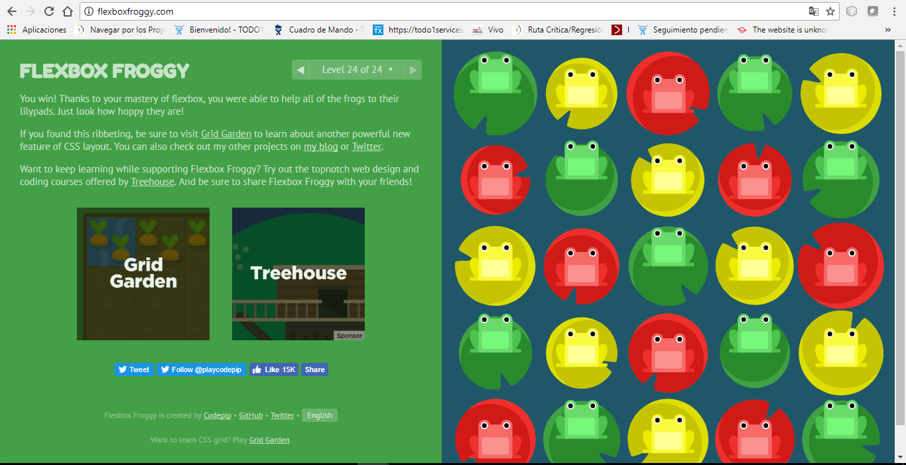

# Bootcamp Front-End!

## 27 de Junio (Primer Día)

### Bitbucket:

Tambien utilizada como llave, que son pública y privada

* Crear la clave privada
* Utilizando la consola, colocamos este comando
   + cat ~/.id_rsa.pub (te genera la clave)
* Ingresar al correo
    * Llega una URL que es el link de la llave, copiar
* Ingresar al GitHub
* Pegar el link de la llave
* Genera la llave Privada


### Descargar Node.js

Primeramentese va a la página de `Node.js` y se descarga la vesión que se nesecite, luego se verifica en la consola si Node.js descargo correctamente. Node.js es una librería que interpreta el JavaScript en otros servidores

**Descargar Un editor**
Puede ser:

```bash
* Sublime 3
* Atom
* brackets
* VS Code
* NetBeans
```

_Para empezar a crear nuestro código utilizamos una página que funciona como un edictor, para irnos familiarizando._


[Webtask]

<hr/>

## 28 de Junio (Segundo Día)

### Qué es Markdown?

Es una forma sencilla de agregar formato a textos web. Se utiliza en varias aplicaciones, como Whatsapp, Twitter, GitHub, para crear el texto en negrita, cursiva y subrayado


[Dillinger]

Donde aprendimos a utilizar las sintasis de Markdown, escribiendo una pequeña biografía acerca de nosotros, donde también agregamos la URL de nuestra foto


### Uso de la Terminal!

Primeramente instalar `git CMD` y `git bash` pero por comodida se usará `git bash`


Los comando básicos para utilizar la Terminal. Muchos comandos utilizan argumentos donde hay más de uno.


|Comando| Descripción |
| ------ | ----------- |
| ls | Lista los contenidos  que esta en la carpeta que abrimos.|
| ls -l | Lista los contenidos que esta en la carpeta de una forma mas larga y con detalles.|
| ls -a | Lista los contenidos que esta en la carpeta incluyendo archivos ocultos.|
|||
| cd | nos redirecciona a la raiz del pc |
|cd (nombre de la carpeta)|nos permite ingresar a la carpeta que necesitamos |
| cd .. | retrocede a la carpeta anterior|
| cd - | Cambia de carpeta a la que sigue. |
|||
| mkdir (nombre de la carpeta) | crea una nueva carpeta sobre la principal|
|||
| rm -r (nombre de la carpeta) | Elimina la carpeta.|
| rm -rf (nombre de la carpeta) | Elimina la carpeta de una forma más forzada.|
|||
| cp (nombre archivo) (nombre archivo1) | Copia (nombre archivo) a (nombre archivo1).|
| cp -r (nombre de la carpeta)  (nombre de la carpeta1) | Copia (nombre de la carpeta)  a (nombre de la carpeta1) . |
|||
| rm (nombre archivo) | Remueve el archivo "file".|
| rm -f (nombre archivo) | Remueve el archivo "file" (Forzado).|
|||
| mv | Renombra el archivo o mover el archivo a otro destino diferente al actual|
| touch (nombre archivo) | crear un archivo ya sea .js .md .html .css|
|Ctrl + U|borra una línea.|
| more (nombre archivo)) | salir del archivo y tiene algo de similitud con el cat.|
|cat | abrir el archivo en la terminal |
|echo | imprimir un codigo |
|tab|podemos utilizarla para autocomplementar lo que estos digitando|
|pwd|Nos permite mirar en que enlace podemos hacer|


_Página web (trello.com)  es un gestor de tareas que permite el trabajo de forma colaborativa mediante tableros y columnas_

<hr/>

## 29 de Junio (Tercer Día)

* descargar GitHub Desktop (Programa que maneja commit de manera gráfica)

### Git Remoto!

```bash
- Ingresar a GitHub
- Crear un nuevo repositorio
- Copiar la URL del SSH
- Ingresar a la consola
- Crear un remoto Git
  * git remote add origin URL
```
### Crear un Commit!

```bash
* Ingresar a la consola
* git add -A
* git status
* git push-U origin master
```

* Si no funciona con *"SSH"*, para crear un *"commit"* también se puede utilizar el *"HTTPS"* de GitHub, pero se utiliza los siguientes:

```bash
* git add .
* git commit -m "texto"
* git push origin2 master
```
### Git Brach

<small> texto pequeño </small> <br/>
<strong> Negrita </strong> (texto importante) <br/>
<em> Italica </em> (Para resaltar lo de "strong") <br/>
< !-- comentarios --> (Para hacer comenttarios) en HTML <br/>
/ * texto* /  para hacer comentarios en JS y CSS <br/>

### Tags o Elementos de HTML

 * < p > < / p > (texto, parrafo)
 * < br />  (Salto de línea)
 * < hr /> (Para pintar una línea horizontal)

_Página web (html5doctor.com) para ver los elementos que utiliza HTML_

### Los link tiene tres partes

 * Absoluto:

```bash
atributo="valor"
< a href="http://......."> Link < a/ >
* Link absoluto= (Link que lleva a otra página)
```

* Esquema (Schema)= Que es el "https"
* Dominio (Dominio)= Que es el Link de la página
* Camino (Path)= Lo que te muestra la carpeta

```bash
atributo="valor"
< a href="http://google.com//imagen/.....">
```
* Relativo:
 * imagen: seria el nombre de la carpeta
 * index.html: Seria la relativa

```bash
atributo="valor"
< a href="http://google.com//imagen/index.html">
```

* Absoluto a la Raíz: <br/>
  Los puntos muestra cuantas carpetas, (también es llamado como servidor local) se tiene que devolver para llegar al index o la que se necesite

```bash
atributo="valor"
< a href="/.imagen/index.html">
```

* Tipo de listas:
 * < ul > < /ul > (lista no ordenada)
 * < ol > < /ol > (lista  ordenada)
 * < li > < /li > (item de la lista)
 * < div > < /div > ( se define como  un bloque)

### Imagénes

```bash
* imagénes locales: Funciona dentro de la carpeta
* Url: < img src="URL" > (como jpg,png)
* Formatos de imagenes:(jpg,git,png,svg)
```
 * JPG: Fotos
 * PNG: Fondo en transparencia
 * GIT: Imagen animada
 * SVG: Vectores (illustrator, etc,.)
 * SRC: Width, casi no se utiliza
 * ALT: Texto alternativo

```bash
 < img src="http://.....">
 < img src="imagen" width="100px"
 < img alt="Descripción de la imagen">
```

 
 [Developer]

 <hr/>

 ## 30 de Junio (Cuarto Día)

 ### Atributos del HTML

 ```bash
 <html lang="en"> (Lenguaje que se va ha utilizar)
 <meta charset="UTF-8"/> (Para los caracteres)
 ```

Con la etiqueta *"Style"* se puede hacer tres formas de estilo como:


```bash
1. <style>
    * Selector {
            propiedad:valor; }
      </style>

2. <p style="color:black;"> Texto </p>

3. <link rel="stylesheet" type="texto/css"
    href="ruta de la página">
```

### Unidades de Medidas

* Px: Es conocido como pixeles, y el más utilizado
* em: Un *em* es el tamaño de la *m* de la base del texto, es decir el doble de *px* 14px; = 1em, 2em = 28px;
* vh: Hace referencia a la centésima parte de la altura del viewport

### Modelo de Caja

* Margin: Muestra el borde hacia afuera creando donde se crea  una margen externa.

* padding: Al contrario del margin creando el borde hacia adentro.

En el **HTML** siempre vamos a diagramar, como si tuvieramos un conjunto de cajas, donde cada caja siempre va ha tener su contenido, un padding, un borde, un margin por todos los costados de la caja.

### Selectores de Clases!

```bash
 <p class="nombre">Texto aquí!</p>

  .nombre {
    color: #B2D6FF;
     }

<p id="clase">Más texto</p>

  #clase {
  propiedad:valor;
}
```

### PSEUDO Clase!

>**Link:** El estado cuando el link no a sido visitado
>>**Visited:** El estado cuando el link a sido visitado
>>>**Hover:** El estado cuando el puntero esta encima

 ### Especifidad

 Esto es como la importancia de las reglas declaradas en el **CSS**, Specifity calculator; es una herramienta que nos sirve para calcular la importancia de las reglas CSS.

<hr/>

## 01 de Julio (Quinto Día)


[Selectores]

>**Width:** De un elemento bloque `block-level`
>>**Max-Whidth:** Importante para dispositivos móviles
>>>**Box-model:** Modelo de caja `box-sizing`
>>>>**Float:** Flotar(envolver imagenes con texto)

```bash
  * Position: Posición
    * static: Queda posicionada donde se deja
    * relative: solo se mueve si el padre lo llama
    * fixed: es fijo no importa si se hace scroll
    * absolute: es engañoso, actua con el fixed
```

<hr/>

## 04 de Julio (Sexto Día)

### SCRUM!!

1. **Planning:**
 * Sprint: dura dos semanas
  * reuniones díarias
  * Refinamiento
  * restrospectiva

2. **Backlog:** Un listado del producto, y eligen lo más importante
 * MVP: Producto Mínimo Viable


### Maquetación

* **Full-bleed:** Es cuando el elemento contiene la maquetación donde ocupa el 100% de la pantalla

* **Overflow:** hidden; (para texto e imagen)

*Los contenedores flotantes no generan heigth, para solucionar esto podemos darle la propiedad Overflow: Hidden al contenedor donde se encuentran los flotantes.*


### JavaScript (Variables)

 * variables, objetos, números, elementos.

```bash
var humano = {
  ojos: "café",
  piel: "Blanco",
  edad: 20,
  esAdulto: false
}
humano
 Object {ojos: "café", piel: "Blanco", edad: 20, esAdulto: false}
   humano.edad
     20

function suma (x, y)
 {

return x + y;
}

undefined
suma

var miSuma = suma (34, 56);
 undefined
   miSuma
    90

var otraSuma = suma
  undefined
    otraSuma (73, 67);
      140
```

### Algoritmos

Es como una receta, cada uno sigue las instruccciones, para llegar a una solución.


[Variable]

<hr/>

## 05 de Julio (Septima Día)

```bash
function calcularEdad(edad) {
  if (edad < 18 ) {
      console.log('Soy menor de edad');
}else if (edad > 18 && edad < 62) {
     console.log('Soy mayor de edad');
}else{
    console.log('Soy de la tercera edad');
  }
}

undefined
calcularEdad(edad)
  Soy mayor de edad
undefined
 edad = 65

calcularEdad(edad)
 Soy de la tercera edad
 ```
* Para validar si el string existe;

  * Operadores!
  * Asignación compuesta (addición) (sustracción)  (multiplicación) y (divición).
   * +=, -=, *=, /=
 * Incrementación!
   * ++ ... = Aumenta los números
 * Igualdad!
   * texto == Número (age == 42)


```bash
if(z && z.length) {
 console.log('Esta vacio');
}
```
<hr/>

## 06 de Julio (Octavo Día)

Gracias a `FlexBox` facilitamos la forma en que posicionamos elementos, es  la forma en que hacemos Responsive Design, evitando así el uso de `float (flotantes).`


[Principio]


[Final]

### Actividad en la terminal!

Ingresar a la terminal y seguir los siguientes pasos:
* javascripting
* cd javascripting/
* javascripting
* javascripting select número
* touch nombre.js
* javascripting verify nombre.js

Con este juego podemos interatuar más acerca de lo que es javascript, e irnos familiarizando.


### HTML Semántico!

Le da un significado al contenido o/a la apariencia

* Document Online
 * título, lista
 * Titulo, texto
 * Subtitulo texto
* Artículos = Articles
  Una sección que tiene su propio contenido, es decir que no esta relacionado con los demás

```bash
<article>
  <h1> Título </h1>
    <p> texto, texto. texto, texto,
       texto y más texto </p>
</article>

<p> copy, July 17 2017 </p>
```
* Secciones = Sections
  Separar las secciones de los artículos, las secciones están relacionados.
* Nav = Elementos de navegación

```bash
<nav>
  <ul>
    <li><a href = "#"> Home </a></li>
    <li><a href = "$"> nav </a></li>
    <li><a href = "%"> Logo </a></li>
  </ul>
</nav>
```
* Footers = Sección de importancia después del artículo
* Asides = Contenido con lo que no tiene relación el contenido, es decir como una publicidad.

<hr/>

## 07 de Julio (Noveno Día)

### Formularios! <br/>

Para crear formularios, se hace con la etiqueta `<form> action='' method= ''</form>`

* Expresiones regulares
 * Place holder = correo, example, ayuda
* Radio buttos
 * label = control del formulario
* Detalist
* Webkit-appearance:none;

**Esté es mi primir formulario!**


[Formulario]

<hr/>

## 08 de Julio (Decimo Día)

```bash
* git pull origin2 -m master
* git status
* git merge --abort
```

*kalidescope(Editor para mirar versiones tanto local como remoto)*

### JSON! <br/>
Para que JSON sea valido si las propiedades llevan "comillas"  Esta basada una sintaxis de JavaScript, pero no siempre son parecidos.

**JSON.PARTSTRINGIFY**

```bash
Humanos.json
Lista
 Nombre (Name)
 Edad (Age)
 Mascotas (Pets)
       cat, dog, fish
 Amigos (Friends)

DOM:
document.createElement('DIV')
<div>?</div>
document.createTextNode('Hola mundo')
```

```bash
"Hola mundo"
document.childNode:[1]
document.childNode:[1].childNodes[2]
document.childNode:[1].childNodes[2].childNodes
```
```bash
document.addEventListener('DOMContentLoaded', function() {
  var form = document.querySelector('form');
      var buttonWarning
      document.querySelector('btn-warning');
        var textarea = form.querySelector('#exampleComment');

    buttonWarning.addEventListener('click', function(event) {
        console.log('el:', this.NnodeName, 'tipo:', event.type );

        textarea.addEventListener('focus', function(event){
        console.log('');

      });

```
```bash

form.addEventListener('submit', function(event){
        event.preventDefault();


1 opción: Para seleccionar

inpust.forEach(function(control){
 if (
   control.type === 'radio' || control.type ! == 'checkbox') $$ control.cheked
   ) {
     data[control.id] = control.value;
   } else if (
   control.type ! == 'radio' || control ! == 'checkbox') {
  data[control.id] = control.value;
}
```
<hr/>

## 11 de Julio (Día once)

### Repesentación del HTML


* Propiedades de los nodos
 * firshChild
 * lastChild
 * childNodes
 * parentNode
 * nextSibling
 * previos
* Metodos que tiene los Nodos: Es un objeto que tiene una propiedad donde contiene elementos.

### Para crear Pull!

* Crear en Atom y GitHub un archivo con el mismo nombre
* Crear commit en GitHub
* Ingresar en la consola

```bash
   * git add .
   * git commit "texto"
   * Git pull origin2 master
```


<hr/>

## 12 de Julio (Día Doce)

* Checkout:para cambiar entre ramas
* Maquetar flexbox
  * Flex- dirección: Manejar la dirección
  * Flex - wrap: Que no haya salto de línea
  * Justify - content: centra el contenido.


```bash
* Git merge: Mezcla los cambios de la ramas
* Git flut: Metodología de como hacer ramas
```

<hr/>

## 13 de Julio (Día Trece)

### Elementos Inline o Bloque

**Inline:** Un elemento en línea ocupa sólo el espacio delimitado por las etiquetas.

**Block:** Un elemento en bloque ocupa todo el espacio de su elemento padre (contenedor), creando así un *"bloque"*.

|Block| Inline |
| ------ | ----------- |
| h1 | em|
| p | stromg|
| div | img|
|||
| article | button|
| aside | script|
| form | input|
|||
| header | label|
| main | select|
| nav | textarea|

<hr/>

## 14 de Julio (Día Catorce)

los elementos posicionados por defecto son estactico

- **Selector child =** Solo selecciona sus hijos
div > span (que el div es mayor que el hijo, que vendría siendo el span)

- **Posicionamiento Relative  =** No respeta el espacio (el más normal para el padre) se mueve a la destacia pero de su espacio
- **Posicionamiento absoluto =** No respeta el espacio (desde el contenedor) pero el se mueve a la distancia, pero desde su padre
- **Posicionamiento Estático =**se trata del posicionamiento que utilizan los navegadores si no se indica lo contrario.

- **Elemento Fijo (fixed) =** Que el elemento se queda fijo
- **SetInterval =** Se va ejecutar siempre, como si fuese infinito
- **SeTimeout =** Es un poco similar el setInterval
- **last of Type =** Seleciona el ultimo contenido del mismo tipo y queda posicionados.

* **Responsive design =** `(max-width:400px)`
* **Layout fluid =** fluido
* **Fixed-width =** Se comporta como estactico

<hr/>

## 15 de Julio (Día Quince)

### GRUNT!

Es una herramienta para automatizar tareas es nuestros proyectos, la idea es que todas esas tareas rutinarias que debemos hacer en nuestros proyectos, es decir un `gestor de tareas`


- **El Modelo =** Que contiene una representación de los datos que maneja el sistema, su lógica de negocio, y sus mecanismos de persistencia.
- **La Vista =** O interfaz de usuario, que compone la información que se envía al cliente y los mecanismos interacción con éste.
- **El Controlador =** que actúa como intermediario entre el Modelo y la Vista, gestionando el flujo de información entre ellos.

### Instalar Bootstrap!

```bash
 * cd code
 * npm install -g yo
 * npm install -g generator-webapp
 * npm install -g gulp-cli bower
 * mkdir (crear carpeta)
 * cd (ingresar a la carpeta)
 * yo webaap
 * bootstrap
 * bootstrap 3
 * BDD
 * gulp serve (para que corra el navegador)
```
* **Bootstrap =** Es un sistema de grillas o rejillas, que esta basado en doce columnas, las cuales usa:
  * Jquery
  * responsive

```bash
* XS = Pantalla extra pequeña
* SM = Pantalla pequeña
* MD = Pantalla media
* LG = Pantalla grande
```


[Responsive]
<hr/>

## 17 de Julio (Día Dieciseis)

* Continuamos con el carousel!

```bash
var carousel function() {
 var carouselGridSelector = '.carousel-grid.carousel-item';

   var showCarousel = function() {
  }
  var hideCarousel = function() {
  }
  var nextSlide = function(){
  }
  var prevSlide = function(){
  }
  var setCurrenSlide = function(){
  }
  var cloneCorueselItems = function(){
  }
  var toggleBodyOverflowHidden = function(){
  }
  var init = function() {
  }
    }
    return {
      init: init
    }

}());
```

### SeudoElementos!

Que se crea antes o después de los elementos, son también llamados fantasmas, los `DIV` los soporta menos los `inpust`.

### Propiedad Transform

<hr/>

## 18 de Julio (Clase Diecisiete)

**Librerías**
* getbootstrap: Documentación
* Jquery ---> Una librería de Dom (http://jqfundamentals.com/)
* fundation.zurb.com/email-temples

* fonoso ---> Variedad de iconos
* iconmonstr ---> Iconos
* velocity.or
https://polyfill.io/v2/docs/ ---> Buscar las diferencias

* Componentes
  * iconos
  * span (Glyphicons)
* Aria tags: Area de accesibilidad

* ** Bootstrap CND** ---> Formas de utilizar bootstrap más sencillo!


* Bootstrap, tiene jquery
$('text') ---> Se selecciona en Jquery

**Propiedades del Jquery**

* Se puede crear también HTML
* closest ---> Para que te devuelva al padre más sercano

**Eliminar carpeta del repositorio (GitHub)**

```bash
* rm -rf Style
* git add --all
* git commit -m "Remover carpeta"
* git push origin2 master
```
<hr/>

## 19 de Julio (Día Diecinueve)

* Librería de **SASS** (compass)
 * npm install -g global

**SCSS** ----> Utilizar

* **Partial:** Contiene guión bajo
* Archivo main.SCSS
  * _mixins.SCSS
  * _responsive.SCSS
  * _color.SCSS

### BEM

* Bloque
* Elemento
* Modificador

```bash
  <div class='nombre'>
    <div class='nombre--texto'>
    <div class='nombre_item'
  </div>
```

* Clase normal (con el nombre)
* Clase Modificadores tien -- (siquieren)
* Clase hijos (se puede utilizar con guión bajo)

### Operador &

* & --> Remplaca el nombre
* &_item --> Poner estilo al hijo

```bash
  .parent {}
     .child{}
```
```bash
  &:child {} ---¬
             Utilizar cuando se tiene seuselectores   
```

* **Variables:** Color
* **Componentes:** Botones
* **Vendors:** _bootstrap (se puede reinscribir)
<hr/>

## 21 de Julio (Día Veinte)

### JavaScript Funcional

* **Efectos Secudarios:** Como su nombre lo indica
* **Funciones Puras:** Que nunca modifican el estado

  * Slice: Inmutable (No cambia los estador) [E.P]
  * Splice: Mutable (Cambia los estados) [F.S]

object.assign({},a,b)

### Composición!

```bash
  function sumar(x,y) {
    return x + y;
  }

    sumar (3 + 5)
     var resultado = 8
```
*Siempre lanza el mismo resultado*

```bash
function compose2(fn1,fn2) {
  return function comp(arg1, arg2, arg2) {
    return fn2(fn1(arg1, arg2),arg3)
  };
}

var mulAndSum = compose2(multi, sumar);
   mulAndSum(7, 8, 9)
```
### Inmutabilidad!

Se utiliza `let`y `const`. El scope es de bloque y no se puede redeclarar, pero se puede cambiar el valor

`object.freeze ()`----> *Congela los niveles pero solo el de arriba y lo que este adentro se puede modificar.*

### Recursión!

```bash
function fibonacci(num) {
  if (num <= 2) return 1;

  return fibonacci(num - 1) + fibonacci(num - 2);
}
```
```bash
function fibonacci(num) {
  var a = 1, b = 0, temp;

  while (num >= 0){
    temp = a;
    a = a + b;
    b = temp;
    num--;
  }

  return b;
 }
 ```
 ```bash
function fibonacci(num) {
  if (num <= 2) return 1;

   return 1 + 1 + 1 + 5;
}
 ```

### Map: Transformación!

Sirve para interar una función sobre cada elemento de un array, *Ejemplo;*

```bash
function doubleIt(val) {
  return val * 2;
}
[1, 2, 3, 4, 5].map(doubleIt);
```

### Filter (Filtrar)

Para filtrar los valores del Array. *Ejemplo*
```bash
function isOdd(val) {
  return val % 2 == 1;
}

[1, 2, 3, 4, 5].filter(isOdd);
```

### Reduce: Combinación

Se reduce los elementos dentro de una Array y lo combina a uno solo. *(metodos funcionales)* esté es un colback , recibe un acomulador y el número actual. Y la función reduce el colback y como inicimos el acolumaldor *Ejemplo*

array.reduce(concatenar, ´´)`// Esté me recibe la función e iniciamos el acomuladorcomo un string vacio.`

```bash
var total = [0, 1, 2, 3].reduce(function(sum, value) {
  return sum + value;
}, 0);
  // total is 6

var flattened = [[0, 1], [2, 3], [4, 5]].reduce(function(a, b) {
  return a.concat(b);
}, []);
  // flattened is [0, 1, 2, 3, 4, 5]
```

<hr/>

## 22 de Julio (Día Veintiuno)

### EMMA SCRIPT 2015

### Let y const

Para declarar variables con un scope de bloque, *Const* no puede cambiar el valor con el que se definió, pero *Let* sí. Sí *Const* es declarado como un objeto no se puede cambiar que sea un objeto pero se los valores dentro de esté.

### Temples Literals

Esté nos sirve para inyectar variables desntro de una cadena, también nos permite agregar salto de línea solo con enter sin necesidad de "\n"
*Ejemplo*

`El ${bootcamp} el ${Front-End}`


### Arrow function

Sí le paso un solo parametro no tengo necesidad de escribir los parentesis(). `El Arrow Fuction, no tiene contexto`<br/>
*Ejemplo*

// item => {return item * 2} <br/>
// [1, 2, 3].map (item => {return item*2})

Sí la función me retorna algo no hay necesidad de escribir las *llaves{}* ni la palabra *return*

```bash
Sintaxis () => {} ;
 (x, y, z) => { return x + y + z}
```

### Spread Operators

Lo que hace el *Spread Operators*, funciona con objetos interables, y los convierte en lista de argumentos

```bash
numeritos
 const numbers = [39, 25, 90, 123];
   const max = Math.max(...numeritos);
 [4, 6, 10 numeritos]
   [4, 6, 10 array (4)]
```

// Función  Math.max me retorna el mayor de los parametros que le pasamos, pero como numbers es un array con los tres puntos del Spread le podemos sacar esos valores del array y pasarlos como un lista de parametros separados por coma. `consolo.log(max)`

### Rest parameters

Es lo como un Spread pero alrevés, es decir, que me coge una lista de argumentos y lo lo convierte en un array. <br/>
*Ejemplo*

```bash
  function sum(...argu) {
    retorn argu.reduce(function(acc, curr) {
      return acc + curr;
    }, 0)
  }
```
**Refactor**

```bash
  function sum(...argu) {
    retorn argu.reduce((acc, curr) => acc + curr, 0)
  }

  sum(1, 2, 4)
```

### Destructuring


<hr/>

## 24 de Julio (Día Veintidos)

<hr/>

<!--- Lista de páginas --->

[Webtask]:https://webtask.io/
[Dillinger]: http://dillinger.io/
[Developer]: https://developer.mozilla.org/
[Selectores]: https://flukeout.github.io/
[Flexbox]: http://flexboxfroggy.com/
[Variable]: about:blank
[Formulario]: file:///C:/Users/Felipe/Desktop/code/frontend_bootcamp/forms/forms.html
